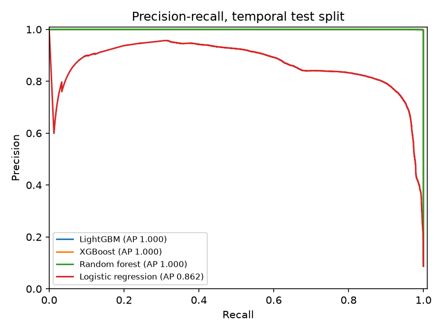
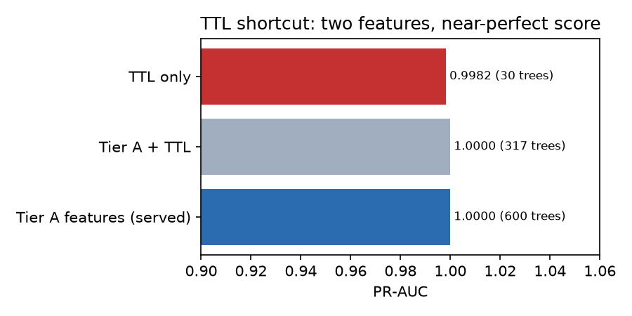
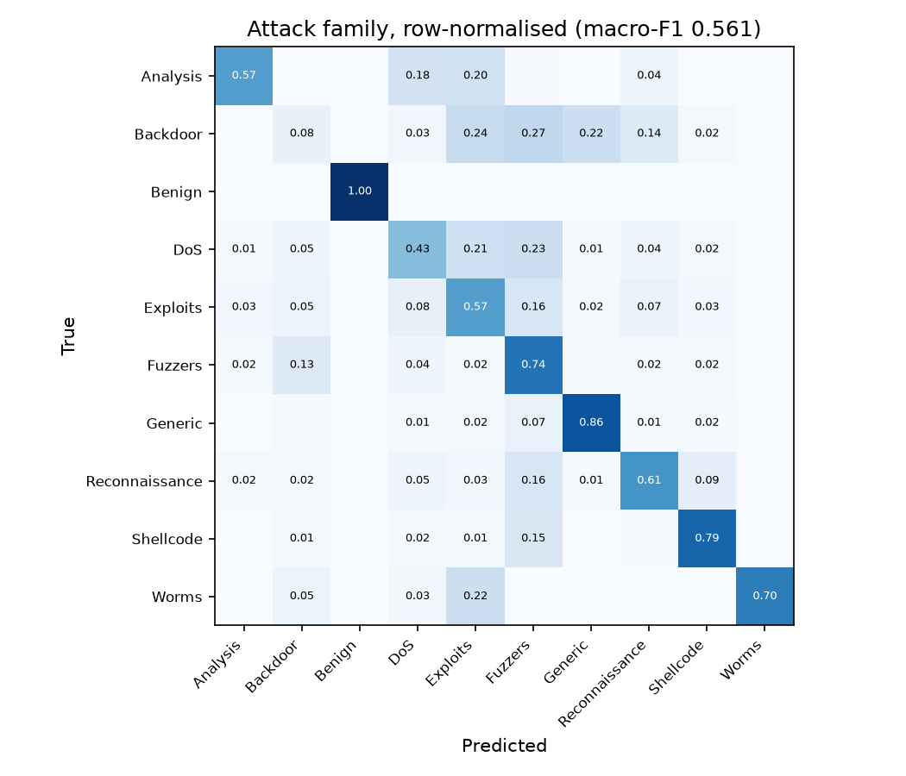
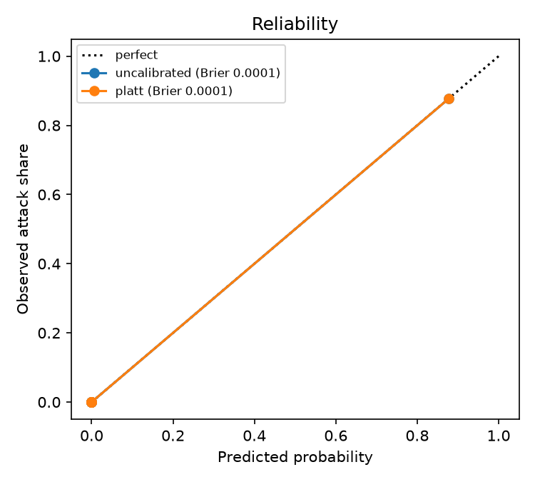
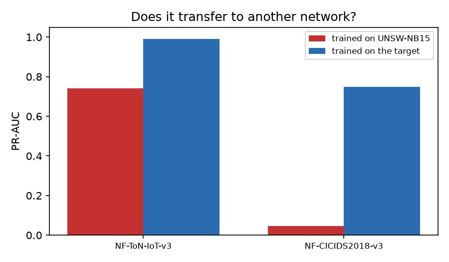

# Tier A evaluation — NF-UNSW-NB15-v3

Generated by `python -m netsentinel_training.eval.benchmark`; every number below is in `results.json` beside this file. Temporal split on `FLOW_START_MILLISECONDS` (train 1,655,797 / val 354,814 / test 354,813 flows; 8.77% attacks in test). Thresholds are chosen on validation for at most 1% false positives, then frozen.

## 1. Learner comparison (13 Tier A features)

| Model | PR-AUC | ROC-AUC | Precision | Recall | F1 | FPR | Fit (s) | µs/flow (batch) |
|---|---|---|---|---|---|---|---|---|
| LightGBM | 1.0000 | 1.0000 | 0.9946 | 1.0000 | 0.9973 | 0.0005 | 74 | 13.85 |
| XGBoost | 1.0000 | 1.0000 | 0.9843 | 1.0000 | 0.9921 | 0.0015 | 132 | 3.85 |
| Random forest | 0.9999 | 1.0000 | 0.9935 | 1.0000 | 0.9967 | 0.0006 | 45 | 1.43 |
| Logistic regression | 0.8619 | 0.9874 | 0.8667 | 0.6364 | 0.7339 | 0.0094 | 15 | 0.32 |

## 2. Shortcut audit: TTL

| Features | PR-AUC | Trees | TTL share of gain | Top features |
|---|---|---|---|---|
| Tier A features (served) | 1.0000 | 600 | 0.00 | pkt_rate, out_pkts, byte_rate |
| Tier A + TTL | 1.0000 | 317 | 0.99 | min_ttl, max_ttl, pkt_rate |
| TTL only | 0.9982 | 30 | 1.00 | min_ttl, max_ttl |

TTL alone separates the classes almost perfectly because it identifies which testbed machine sent the flow, not what the flow did. It is therefore excluded from Tier A (`contract.TIER_A_FEATURES`); the served model is the first row.

## 3. Recall per attack family (at the 1%-FPR threshold)

| Family | Tier A (LightGBM) | Tier D (LOF, benign-only) |
|---|---|---|
| Analysis | 100.00% | 0.00% |
| Backdoor | 100.00% | 36.51% |
| DoS | 100.00% | 21.39% |
| Exploits | 100.00% | 23.70% |
| Fuzzers | 100.00% | 37.21% |
| Generic | 100.00% | 80.41% |
| Reconnaissance | 100.00% | 39.95% |
| Shellcode | 100.00% | 44.83% |
| Worms | 100.00% | 24.32% |

### Tier D: which unsupervised detector

Benign-only training, calibrated on validation benign flows, flagged at the 1% budget; on a 100k-flow test sample shared by all three.

| Detector | PR-AUC | Recall | FPR |
|---|---|---|---|
| Isolation Forest, raw features, 256-row subsamples (M2 default) | 0.0957 | 0.25% | 0.80% |
| Isolation Forest, log features, 4096-row subsamples (served) | 0.6505 | 40.37% | 0.91% |
| Local Outlier Factor, log features (not servable: see Tier D) | 0.9341 | 89.90% | 0.95% |

The log transform is what matters: counts span nine orders of magnitude and a forest splits uniformly between a feature's extremes. LOF ranks best but exported to ONNX it searches its reference set on every call (over 100 ms per flow against the 5 ms budget of NFR-01), so the forest is served.

Tier D never sees an attack in training; at a 1.98% false-positive rate it recalls 39.11% of attacks (PR-AUC 0.6389). It is the tier that objects to the unfamiliar, not the one that names it.

### Attack family classifier

Multiclass LightGBM over the same 13 features: **macro-F1 0.5612** (attack classes only 0.5124; weighted 0.9701).

| Class | Precision | Recall | F1 | Support |
|---|---|---|---|---|
| Analysis | 0.249 | 0.571 | 0.347 | 294 |
| Backdoor | 0.055 | 0.077 | 0.064 | 1,260 |
| Benign | 1.000 | 1.000 | 1.000 | 323,706 |
| DoS | 0.253 | 0.433 | 0.320 | 1,234 |
| Exploits | 0.854 | 0.570 | 0.684 | 10,815 |
| Fuzzers | 0.611 | 0.740 | 0.670 | 7,387 |
| Generic | 0.881 | 0.861 | 0.871 | 5,126 |
| Reconnaissance | 0.701 | 0.615 | 0.655 | 4,548 |
| Shellcode | 0.233 | 0.793 | 0.360 | 406 |
| Worms | 0.591 | 0.703 | 0.642 | 37 |

## 4. Calibration

| | Brier score |
|---|---|
| uncalibrated | 0.00008 |
| platt | 0.00008 |

## 5. Cross-dataset generalisation

| Target dataset | Attack share | UNSW-trained PR-AUC | recall | FPR | In-domain PR-AUC | recall | FPR |
|---|---|---|---|---|---|---|---|
| NF-ToN-IoT-v3 | 44.94% | 0.7410 | 0.8115 | 0.5087 | 0.9912 | 0.0383 | 0.0002 |
| NF-CICIDS2018-v3 | 8.64% | 0.0467 | 0.1757 | 0.8933 | 0.7489 | 0.0409 | 0.0048 |

Two different failures. Trained on UNSW and moved elsewhere, the model ranks worse and its threshold is meaningless on the new traffic (the false-positive column). Trained on the target itself, it ranks well (PR-AUC) but a threshold set on the validation period misses most attacks in the test period, because the attack mix changes over time. Both are why every model is born in shadow mode and promoted only on measured, site-local evidence.

## 6. Serving latency (NFR-01: ≤ 5 ms per flow)

Exported ONNX graph, one flow per call over 2,000 test flows: p50 **0.074 ms**, p99 **0.194 ms** (Tier A).
Tier D, the same way: p50 **8.159 ms**, p99 **17.138 ms**.
